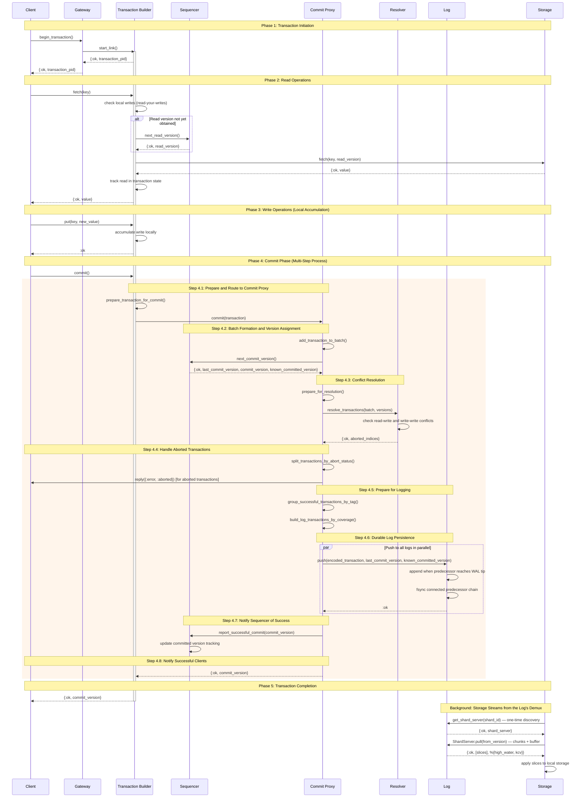

# Transaction Building and Committing Process in Bedrock

This document explains the complete process of building and committing a transaction in the Bedrock distributed key-value store, from reading a key to committing a modification of that key. **This is the definitive technical reference for transaction processing in Bedrock**.

## Overview

Bedrock implements a distributed ACID transaction system based on FoundationDB's architecture. The transaction process involves multiple specialized components working together to provide strict serialization while maintaining high performance through optimistic concurrency control (MVCC).

> **Navigation**: This document provides the complete technical implementation details. For quick reference, start with [Transaction Overview](../quick-reads/transactions.md). For architectural context, see [Architecture Deep Dive](architecture.md). For component-specific details, see individual [Component Documentation](./architecture.md).

## Key Components

- **Client**: Application code that initiates and executes transactions
- **[Gateway](architecture/infrastructure/gateway.md)**: Client interface that manages transaction coordination
- **[Transaction Builder](architecture/infrastructure/transaction-builder.md)**: Per-transaction process that accumulates reads/writes and manages transaction state
- **[Sequencer](architecture/data-plane/sequencer.md)**: Assigns global version numbers for reads and commits (Lamport clock)
- **[Commit Proxy](architecture/data-plane/commit-proxy.md)**: Batches transactions for efficient processing and conflict resolution
- **[Resolver](architecture/data-plane/resolver.md)**: Implements MVCC conflict detection across key ranges
- **[Log System](architecture/data-plane/log.md)**: Provides durable transaction storage with strict ordering
- **[Storage (Olivine)](architecture/data-plane/storage.md)**: Serves versioned key-value data and applies committed transactions

> 💡 **Deep Dive Available**: Click on any component name above to access detailed technical documentation including APIs, implementation details, performance characteristics, and code references.

## Complete Transaction Sequence Diagram



## Component Deep Dives

For detailed technical documentation on any component, see the [Components Documentation](./architecture.md) directory:

- **[Gateway Deep Dive](architecture/infrastructure/gateway.md)** - Client interface, version leasing, worker advertisement
- **[Transaction Builder Deep Dive](architecture/infrastructure/transaction-builder.md)** - Per-transaction processes, read-your-writes, storage coordination  
- **[Sequencer Deep Dive](architecture/data-plane/sequencer.md)** - Version assignment, Lamport clock, global ordering
- **[Commit Proxy Deep Dive](architecture/data-plane/commit-proxy.md)** - Transaction batching, finalization pipeline, client coordination
- **[Resolver Deep Dive](architecture/data-plane/resolver.md)** - MVCC conflict detection, version history, range processing
- **[Log System Deep Dive](architecture/data-plane/log.md)** - Durable storage, replication, recovery coordination
- **[Shale Deep Dive](architecture/implementations/shale.md)** - Disk-based log implementation, WAL architecture
- **[Storage Deep Dive](architecture/data-plane/storage.md)** - Multi-version storage, MVCC reads, log integration

## Transaction Format

Bedrock uses a sophisticated tagged binary format for transaction encoding that replaced the simple map structure. This format provides several key advantages:

### Binary Structure

- **Tagged sections**: Self-describing sections with type, size, and embedded CRC validation
- **Order independence**: Sections can appear in any order for better extensibility  
- **Efficient operations**: Extract specific sections without full decode
- **Space optimization**: Empty sections are omitted, opcodes are size-optimized

### Section Types

- **MUTATIONS** (0x01): Always present, contains `{:set, key, value}` and `{:clear_range, start, end}` operations
- **READ_CONFLICTS** (0x02): Present when transaction performed reads, includes read version
- **WRITE_CONFLICTS** (0x03): Present when write conflicts exist
- **COMMIT_VERSION** (0x04): Added by commit proxy after version assignment

### Usage Throughout System

The flexible design allows each component to work with only needed sections:

- **Transaction Builder → Commit Proxy**: Full transaction with mutations, conflicts, and read version
- **Commit Proxy → Resolver**: Conflicts and versions for conflict detection (mutations not needed)
- **Commit Proxy → Logs**: Mutations and commit version for storage (conflicts not needed)

This approach improves efficiency and reduces data transfer overhead between components.

> **Binary Format**: Transactions use Transaction encoding with tagged binary sections for efficient processing. See the [deep dive](../quick-reads/transaction-format.md) for technical details.

## Detailed Phase Breakdown

### Phase 1: Transaction Initiation

**Purpose**: Establish a transaction context and obtain a consistent read version.

**Process**:

1. Client calls `Bedrock.Repo.transact/1`
2. Gateway creates a new Transaction Builder process via `start_link/1`
3. Transaction Builder initializes with gateway reference and transaction system layout
4. Client receives transaction builder PID for subsequent operations

**Key Code Locations**:

- Gateway creation: `lib/bedrock/cluster/gateway.ex:19`
- Transaction Builder startup: `lib/bedrock/cluster/gateway/transaction_builder.ex:22`

### Phase 2: Read Operations

**Purpose**: Read data at a consistent snapshot version while tracking read keys for conflict detection.

**Process**:

1. Client calls `fetch/2` on the transaction builder
2. Transaction builder checks local writes first (read-your-writes consistency)
3. If not found locally and no read version exists:
   - Request read version from Sequencer via `next_read_version/1`
4. Fetch data from Storage servers at the read version
5. Storage performs "horse race" across replicas for performance
6. Transaction builder tracks the read key and value
7. Return value to client

**Key Code Locations**:

- Fetching logic: `lib/bedrock/cluster/gateway/transaction_builder/fetching.ex:10`
- Read version management: `lib/bedrock/cluster/gateway/transaction_builder/read_versions.ex:11`
- Storage fetch: `lib/bedrock/data_plane/storage.ex:33`

**Read-Your-Writes Consistency**: The transaction builder maintains local writes in memory, ensuring that reads within the same transaction immediately see previous writes without network calls.

### Phase 3: Write Operations

**Purpose**: Accumulate write operations locally without network traffic until commit time.

**Process**:

1. Client calls `put/3` on the transaction builder
2. Transaction builder accumulates writes in local memory
3. No network operations occur during writes
4. Writes are immediately visible to subsequent reads within the same transaction

**Key Code Locations**:

- Write accumulation: `lib/bedrock/cluster/gateway/transaction_builder/putting.ex`
- Local write storage: `lib/bedrock/cluster/gateway/transaction_builder/state.ex:16`

**Optimization**: This batching approach minimizes network traffic and allows for optimistic concurrency control.

### Phase 4: Commit Phase

This is the most complex phase involving multiple distributed components working together.

#### Step 4.1: Prepare and Route to Commit Proxy

**Process**:

1. Transaction builder calls `do_commit/1`
2. Prepare transaction using Transaction binary format:
   - `mutations`: List of `{:set, key, value}` or `{:clear_range, start, end}` operations
   - `read_conflicts`: `{read_version, [read_conflict_ranges]}` or `{nil, []}` for write-only transactions
   - `write_conflicts`: List of write conflict ranges for all mutations
   - Uses tagged binary sections with CRC validation for efficient processing
3. Select a Commit Proxy randomly from available commit proxies
4. Send encoded transaction to selected Commit Proxy

**Key Code Locations**:

- Commit preparation: `lib/bedrock/cluster/gateway/transaction_builder/committing.ex:8`
- Transaction format: `lib/bedrock/data_plane/bedrock_transaction.ex`

#### Step 4.2: Batch Formation and Version Assignment

**Purpose**: Improve throughput by batching multiple transactions and assign global commit version.

**Process**:

1. Commit Proxy adds transaction to current batch
2. When batch reaches finalization criteria (size or timeout):
   - Request commit version from Sequencer via `next_commit_version/1`
   - Sequencer returns `last_commit_version`, `commit_version`, and the `known_committed_version` (KCV)
   - The `{last, current}` pair defines the Lamport predecessor chain; numeric gaps are valid, but every log appends only the connected prefix
   - KCV is an independent monotonic watermark carried on every log push and accumulated with `max`, so downstream durability machinery (Demux chunk cuts, storage eviction) can gate on it even when a future transaction is parked

**Key Code Locations**:

- Batching logic: `lib/bedrock/data_plane/commit_proxy/batching.ex`
- Server handling: `lib/bedrock/data_plane/commit_proxy/server.ex:110`

#### Step 4.3: Conflict Resolution

**Purpose**: Detect and resolve transaction conflicts using Multi-Version Concurrency Control (MVCC).

**Process**:

1. **Validation**: Validate transaction format using Transaction validation
   - Verify binary format integrity with CRC checks
   - Ensure transaction summaries conform to expected format
   - Handle validation errors with appropriate telemetry
2. Transform transactions into conflict resolution format
3. Distribute transactions to appropriate Resolvers based on key ranges
4. Each Resolver checks for:
   - **Read-Write conflicts**: Transaction read a key that was written by a later-committed transaction
   - **Write-Write conflicts**: Two transactions wrote to the same key
   - **Within-batch conflicts**: Transactions in the same batch conflict with each other
5. **Timeout handling**: Transactions waiting for version ordering may timeout (default 30 seconds)
6. Return list of aborted transaction indices or timeout errors

**Key Code Locations**:

- Conflict resolution: `lib/bedrock/data_plane/commit_proxy/finalization.ex:257`
- Resolver implementation: `lib/bedrock/data_plane/resolver.ex`

**MVCC Details**: Conflicts are detected by comparing transaction read/write sets against the version history maintained by Resolvers.

#### Step 4.4: Handle Aborted Transactions

**Purpose**: Immediately notify clients of aborted transactions to minimize latency.

**Process**:

1. Split transactions into aborted and successful sets
2. Send `{:error, :aborted}` responses to aborted transaction clients
3. Continue processing successful transactions

**Key Code Locations**:

- Transaction splitting: `lib/bedrock/data_plane/commit_proxy/finalization.ex:421`

#### Step 4.5: Prepare for Logging

**Purpose**: Organize successful transactions by storage team tags for efficient log distribution.

**Process**:

1. Group writes by storage team tags (key ranges)
2. Build transaction shards for each tag
3. Ensure all keys are covered by storage teams (coverage validation)

**Key Code Locations**:

- Tag grouping: `lib/bedrock/data_plane/commit_proxy/finalization.ex:522`
- Coverage validation: `lib/bedrock/data_plane/commit_proxy/finalization.ex:602`

#### Step 4.6: Durable Log Persistence

**Purpose**: Achieve durability by persisting transactions to multiple log servers.

**Process**:

1. Build transaction for each log based on tag coverage
2. Encode transactions for each log server
3. Push transactions to ALL log servers in parallel
4. Each log parks future predecessor links and drains the connected prefix in chain order
5. Wait for acknowledgment from ALL log servers (ack sent only after that transaction's WAL append + fsync; Demux is asynchronous)
6. If any log fails, trigger recovery (fail-fast approach)

**Key Code Locations**:

- Log push coordination: `lib/bedrock/data_plane/commit_proxy/finalization.ex:744`
- Individual log push: `lib/bedrock/data_plane/log.ex:56`

**Durability Guarantee**: ALL logs must acknowledge only after WAL append + fsync before transaction is considered committed.

#### Step 4.7: Notify Sequencer of Success

**Purpose**: Update the sequencer's committed version tracking for future conflict resolution.

**Process**:

1. Call `report_successful_commit/2` on Sequencer
2. Sequencer updates its internal committed version tracking
3. This information is used for future read version assignments

**Key Code Locations**:

- Sequencer notification: `lib/bedrock/data_plane/commit_proxy/finalization.ex:829`

#### Step 4.8: Notify Successful Clients

**Purpose**: Inform clients that their transactions have been successfully committed.

**Process**:

1. Send `{:ok, commit_version}` to all successful transaction clients
2. Clients can use the commit_version for debugging and monitoring

**Key Code Locations**:

- Success notification: `lib/bedrock/data_plane/commit_proxy/finalization.ex:856`

### Phase 5: Transaction Completion

**Purpose**: Clean up transaction resources and return final result to client application.

**Process**:

1. Client receives final transaction result
2. Transaction Builder process terminates
3. Resources are cleaned up
4. Client application continues execution

## Background Operations

### Storage Updates from the Demux

**Purpose**: Eventually consistent application of committed transactions to storage servers.

**Process**:

1. Each storage server streams its shard's slices from a log's Demux ShardServer — object-storage chunks for history, the in-memory buffer for recent data, one continuous stream
2. Slices are applied in version order; empty "current through v" replies advance the server's version when its shard is idle
3. Storage maintains multiple versions for MVCC reads, applying eagerly but persisting to disk only up to the known committed version
4. Old versions leave memory through window advancement based on version-time lag

**Key Code Locations**:

- Storage streaming: `lib/bedrock/data_plane/materializer/olivine/streaming.ex`
- Shard serving: `lib/bedrock/data_plane/demux/shard_server.ex`
- Log pull (recovery-only): `lib/bedrock/data_plane/log.ex`

## Error Handling and Recovery

### Transaction Conflicts

- Clients receive `{:error, :aborted}` for conflicted transactions
- Applications should retry with exponential backoff
- Conflicts are natural in optimistic concurrency control

### Validation Errors

- **Format Validation**: Transaction binary format validation with CRC checks
- **Transaction Summary Validation**: Ensures transaction summaries conform to expected `{read_info | nil, write_keys}` format
- **Waiting List Validation**: Validates transactions before adding to resolver waiting queues
- All validation failures include detailed telemetry for debugging

### Timeout Handling

- **Waiting List Timeout**: Transactions waiting for version ordering timeout after 30 seconds (default)
- **WaitingList Management**: Automatic cleanup of expired transactions with appropriate error responses

### System Failures

- **Log Server Failures**: Trigger commit proxy recovery (fail-fast)
- **Storage Server Failures**: Reads continue from replicas
- **Commit Proxy Failures**: Director detects and starts new commit proxies
- **Network Partitions**: Raft consensus ensures consistency

### Version Management

- **Version Too Old**: Storage no longer has the requested version
- **Version Too New**: Read version exceeds current committed version

## Performance Characteristics

### Optimizations

1. **Batching**: Multiple transactions processed together
2. **Pipelining**: Read versions assigned while commits process
3. **Local Caching**: Transaction builders cache storage server choices
4. **Horse Racing**: Parallel queries to multiple storage replicas
5. **Tag-Based Sharding**: Efficient distribution of writes across logs

### Latency Sources

1. **Network Round Trips**: Client ↔ Gateway ↔ Data Plane components
2. **Conflict Resolution**: Resolver processing time
3. **Log Durability**: Disk I/O for transaction persistence
4. **Version Assignment**: Sequencer coordination

### Throughput Factors

1. **Batch Size**: Larger batches improve throughput but increase latency
2. **Conflict Rate**: High conflicts reduce effective throughput
3. **Key Distribution**: Hot keys can become bottlenecks
4. **Storage Parallelism**: More storage servers improve read throughput

## Transaction Guarantees (ACID)

### Atomicity

- All writes in a transaction commit together or none do
- Partial commits are impossible due to conflict resolution + logging

### Consistency

- All transactions see a consistent view at their read version
- Invariants are maintained through conflict detection

### Isolation

- Strict serialization: transactions appear to execute sequentially
- Read-your-writes consistency within transactions
- No dirty reads, phantom reads, or write skew

### Durability

- Committed transactions survive system failures
- ALL log servers must WAL-fsync acknowledge before commit confirmation
- Storage servers eventually reflect all committed transactions

## Client Usage Examples

Based on the BedrockEx test harness, here are practical examples of how applications use Bedrock transactions:

### Simple Key-Value Operations

```elixir
# Basic put operation
def hello do
  Repo.transact(fn ->
    Repo.put("hello", "world")
    {:ok, :ok}
  end)
end

# Basic get operation  
def hello2 do
  Repo.transact(fn ->
    {:ok, Repo.get("hello")}
  end)
end
```

### Complex Business Logic: Money Transfer

```elixir
def move_money(amount, account1, account2) do
  Repo.transact(fn ->
    with :ok <- check_sufficient_balance_for_transfer(account1, amount),
         {:ok, new_balance1} <- adjust_balance(account1, -amount),
         {:ok, new_balance2} <- adjust_balance(account2, amount) do
      {:ok, {new_balance1, new_balance2}}
    end
  end)
end

def check_sufficient_balance_for_transfer(account, amount) do
  with {:ok, balance} <- fetch_balance(account) do
    if can_withdraw?(amount, balance) do
      :ok
    else
      {:error, "Insufficient funds"}
    end
  end
end

def fetch_balance(account) do
  case Repo.fetch(key_for_account_balance(account)) do
    {:ok, balance} -> {:ok, balance}
    _ -> {:error, "Account not found"}
  end
end

def adjust_balance(account, amount) do
  with {:ok, balance} <- fetch_balance(account) do
    new_balance = balance + amount
    Repo.put(key_for_account_balance(account), new_balance)
    {:ok, new_balance}
  end
end

def key_for_account_balance(account), do: {"balances", account}
```

### Batch Operations

```elixir
def setup_accounts do
  Repo.transact(fn ->
    Repo.put(key_for_account_balance("1"), 100)
    Repo.put(key_for_account_balance("2"), 500)
    {:ok, :ok}
  end)
end

# High-volume transaction example
def rando do
  1..10_000
  |> Enum.each(fn _ ->
    Repo.transact(fn ->
      1..5
      |> Enum.each(fn _ ->
        key = :crypto.strong_rand_bytes(5) |> Base.encode32(case: :lower)
        value = :crypto.strong_rand_bytes(5) |> Base.encode32(case: :upper)
        Repo.put(key, value)
      end)
      {:ok, :ok}
    end)
  end)
end
```

### Repository Configuration

```elixir
defmodule BedrockEx.Repo do
  use Bedrock.Repo,
    cluster: BedrockEx.Cluster,
    key_codecs: [
      default: Bedrock.KeyCodec.TupleKeyCodec  # Supports structured keys like {"balances", "account1"}
    ],
    value_codecs: [
      default: Bedrock.ValueCodec.BertValueCodec  # Elixir term serialization
    ]
end

# Note: Transaction binary format handles the low-level encoding/decoding
# of mutations and conflict ranges transparently to client applications
```

## Key Transaction Patterns

### 1. Read-Modify-Write Pattern

The money transfer example demonstrates the classic read-modify-write pattern:

- Read current balance (`fetch_balance`)
- Validate business rules (`check_sufficient_balance`)
- Modify data (`adjust_balance`)
- All within a single transaction for atomicity

### 2. Read-Your-Writes Consistency

Within a transaction, all reads immediately see previous writes:

```elixir
Repo.transact(fn ->
  Repo.put("key", "value1")
  {:ok, "value1"} = Repo.get("key")  # Sees the write immediately
  Repo.put("key", "value2")
  {:ok, "value2"} = Repo.get("key")  # Sees the updated value
  {:ok, :ok}
end)
```

### 3. Structured Keys

Using tuple keys for hierarchical data organization:

```elixir
key_for_account_balance(account) -> {"balances", account}
# This creates keys like {"balances", "123"} which can be efficiently 
# range-queried and distributed across storage teams
```

### 4. Error Handling

Transactions can return errors that cause rollback:

```elixir
case Repo.transact(fn ->
  case some_operation() do
    {:ok, result} -> {:ok, result}
    {:error, reason} -> {:error, reason}  # Transaction rolls back
  end
end) do
  {:ok, result} -> handle_success(result)
  {:error, :aborted} -> handle_conflict()  # Retry logic here
  {:error, reason} -> handle_error(reason)
end
```

## Conclusion

The Bedrock transaction system provides a sophisticated implementation of distributed ACID transactions with strong consistency guarantees. The multi-phase commit process, while complex, enables high performance through batching, pipelining, and optimistic concurrency control while maintaining strict serialization semantics.

The architecture separates concerns cleanly:

- **Control Plane**: Manages cluster coordination and recovery
- **Data Plane**: Handles transaction processing and data storage
- **Client Interface**: Provides simple transaction semantics

This separation allows for independent scaling and optimization of each component while maintaining system-wide consistency and availability.

From the client perspective, the system provides intuitive transaction semantics that hide the underlying distributed complexity while delivering strong ACID guarantees. The examples from BedrockEx demonstrate how applications can build complex business logic on top of Bedrock's transactional foundation.
