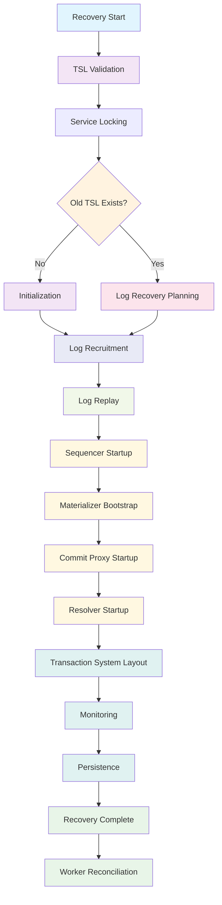

# Bedrock Recovery

**For comprehensive details and deeper context, see the [Recovery Guide](../deep-dives/recovery.md).**

Recovery rebuilds the entire transaction system from what survived, rather
than repairing pieces in place. Each attempt is a pure function of the
coordinator's current view of available services: if an attempt fires before
the services it needs have registered, it fails cheaply and leaves nothing
behind, and the next registration triggers the attempt that succeeds.

## Recovery Flow

## Recovery Phases

0. **[TSL Validation](recovery/tsl-validation.md)** - Validate type safety
   of the recovered transaction system layout before trusting it.
1. **[Service Locking](recovery/service-locking.md)** - Lock the old
   layout's logs and every advertised materializer, collecting each one's
   recovery info (durable version, and for materializers, shard
   assignment). Locking fences older epochs and tells recovery what
   survived.
2. **[Log Recovery Planning](recovery/log-recovery-planning.md)** - From
   the locked logs, compute the version vector (the range of transactions
   guaranteed complete across survivors) and seed vacancies for a fresh
   generation of logs.
3. **[Log Recruitment](recovery/log-recruitment.md)** - Fill the log
   vacancies: reuse advertised log workers where possible, create new ones
   where not. Workers created during the attempt are locked through the
   references recovery already holds, so recruitment completes in a single
   attempt.
4. **[Log Replay](recovery/log-replay.md)** - Copy the surviving WAL tail
   into the new generation of logs. The copy range is
   `(max(durable_through, available_after), last_inclusive]`; the persisted
   lower cursor preserves the first retained transaction even after trim and
   restart. History below it is already durable in object-storage chunks, so
   replay cost is bounded by the untrimmed tail, not the cluster's age.
5. **[Sequencer Startup](recovery/sequencer-startup.md)** - Start the
   global version authority at the recovery version.
6. **Materializer Bootstrap** - Reuse the surviving materializers: hand
   each one its shard back, unlocked at the recovery version so it resumes
   streaming from its own applied position. The system-shard materializer
   catches up and serves the shard layout, which drives resolver placement
   and shard routing. Only a shard with no survivor gets a fresh
   materializer, which rebuilds from chunks.
7. **[Commit Proxy Startup](recovery/proxy-startup.md)** - Deploy commit
   proxies for transaction processing.
8. **[Resolver Startup](recovery/resolver-startup.md)** - Start MVCC
   conflict detection, one resolver per shard range in the recovered
   layout.
9. **[Transaction System Layout](recovery/transaction-system-layout.md)** -
   Assemble the coordination blueprint: the new logs, the active
   materializers, proxies, resolvers, and the shard layout.
10. **[Monitoring](recovery/monitoring.md)** - Watch every component before
    the final system transaction, so failures fail fast instead of
    wedging.
11. **[Persistence](recovery/persistence.md)** - Durably store the new
    layout via a system transaction — which also proves the entire new
    pipeline works end to end.

## After Recovery: Worker Reconciliation

The durable layout is the single source of truth for what should exist.
When the new layout is broadcast, every foreman compares the workers it
hosts against it and retires the ones the layout does not reference:
previous-generation logs (their data was replayed forward before the layout
became durable) and any strays left behind by interrupted attempts. Recovery
is the only way workers are created; reconciliation is the only way they are
destroyed. A cluster that restarts every day holds a constant worker
population.

## Recovery Entry Point

Recovery begins when the Director creates a `RecoveryAttempt` with the
current timestamp, cluster configuration, and epoch. Before each attempt,
the Director refreshes its service view from the coordinator's directory —
on a booting node, workers register as they come up, and a view captured at
director start goes stale immediately.

## Implementation References

- **Main Recovery Module**: `lib/bedrock/control_plane/director/recovery.ex`
- **Phase Implementations**: `lib/bedrock/control_plane/director/recovery/*_phase.ex`
- **Recovery Attempt State**: `lib/bedrock/control_plane/config/recovery_attempt.ex`
- **Worker Reconciliation**: `lib/bedrock/service/foreman/impl.ex` (`do_reconcile_workers/2`)

## See Also

- [Recovery Deep Dive](../deep-dives/recovery.md) - Comprehensive recovery system analysis
- [Durability Foundation](../../guides/durability-foundation.md) - How data becomes durable, and why replay is bounded
- [Bedrock Architecture](../deep-dives/architecture.md) - Overall system architecture
- [Transaction System Layout](transaction-system-layout.md) - System coordination blueprint
